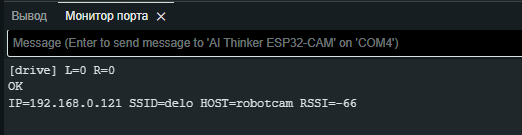

# Robot View (ESP32-CAM + Arduino) — веб-джойстик, стрим и управление колёсами

> **Проверено:** сборка и прошивка в Arduino IDE c **ESP32 Arduino core 3.0.7** и стандартным Arduino AVR core (Nano/Uno).  
> **Связь:** UART-пакеты `0xAA 0x55 <L:int8> <R:int8>` на скорости **115200 бод**.


## Содержание
- [Идея и возможности](#идея-и-возможности)
- [Архитектура](#архитектура)
- [Аппаратная часть и распиновка](#аппаратная-часть-и-распиновка)
- [Установка и сборка](#установка-и-сборка)
- [Веб‑интерфейс](#веб-интерфейс)
- [Команды по UART (CLI ESP32)](#команды-по-uart-cli-esp32)
- [HTTP API](#http-api)
- [Протокол пакетов к Arduino](#протокол-пакетов-к-arduino)
- [Скетчи и логика работы](#скетчи-и-логика-работы)
- [Fail-safe и безопасность](#fail-safe-и-безопасность)

---

## Идея и возможности

**Robot View** объединяет видеострим с ESP32-CAM и управление двухколёсной платформой (танковое руление) через веб-джойстик.  
Под капотом:
- MJPEG-стрим с ESP32-CAM (встроенный веб-сервер).
- Джойстик в браузере (мобильный и десктоп): преобразование `(x,y)` → левое/правое колесо.
- Периодическая передача команд на Arduino по UART (**каждые 30мс**).
- «Стартовый ШИМ» (deadband lift) на стороне ESP32, чтобы колёса уверенно стартовали.
- На Arduino: масштабирование команд ×2 с насыщением, **перестановка L↔R** (см. ниже).
- Аварийный стоп при потере связи; аппаратная кнопка стопа.


---

## Архитектура

ESP32-CAM:
- Поднимает Wi-Fi STA, web UI и MJPEG `/stream`.
- Конвертирует джойстик → `L/R [-127..127]`, сглаживает (EMA), применяет deadband lift.
- Отправляет UART-пакеты `AA 55 L R` на **TX2 = GPIO12** (см. распиновку).

Arduino (Nano/Uno):
- Принимает пакеты, контролирует драйвер Н-мостов.
- Преобразует `int8 [-127..127]` → PWM `[-255..255]` (×2 с насыщением).
- **Важно:** подаёт **R на левое колесо**, а **L на правое** (перевёрнутая кинематика в данном шасси).



---

## Аппаратная часть и распиновка

**Связь:** ESP32‑CAM TX2 (GPIO12) → Arduino RX0 (D0). Общая земля GND обязательна.

**Arduino Nano/Uno (скетч `arduino_drive.ino`):**
- `DIR_L = 8`, `PWM_L = 9`
- `DIR_R = 5`, `PWM_R = 6`
- `BUTTON_PIN = 7` *(INPUT_PULLUP — нажато = LOW)* — аварийный STOP
- `LED_HB = 13` — вспышка при приёме пакета

**Скорость порта:** `115200` бод.

**Отладочный приёмник (`arduino_reading.ino`)** — выводит в порт пары `L=.. R=..` для диагностики.

---

## Установка и сборка

> **Проверено:** Arduino IDE + **ESP32 core 3.0.7**. Если у вас иная версия — параметры могут отличаться.


1. **Зависимости/платы:**
   - Установите поддержку плат **ESP32** (верс. 3.0.7) и **Arduino AVR** (Nano/Uno).
2. **ESP32-CAM (скетч `esp32_code.ino`):**
   - Плата: *AI Thinker ESP32‑CAM* (или совместимая).
   - Upload speed 115200–921600; выбор GPIO/PSRAM по вашей плате (скетч настроен под AI Thinker).
3. **Arduino (скетч `arduino_drive.ino`):**
   - Плата: *Arduino Nano (ATmega328P)* или *Uno*.
   - Частота PWM — стандартная (через `analogWrite`). Подключите Н‑мосты к пинам из раздела выше.
4. **Проводка и питание:**
   - ESP32-CAM TX2 (GPIO12) → Arduino D0 (RX0). **GND общий.**
   - Питание двигателей через драйвер моторов с отдельным источником, общим GND.
5. **Первичный запуск:**
   - Прошейте обе платы. Подключитесь к монитору порта ESP32 (115200).

---

## Веб‑интерфейс

Откройте в браузере `http://<ip_esp32>` — появится страница со стримом и круговым джойстиком.  
Особенности:
- Поле‑«полусфера»: при малых |Y| разрешает «поворот на месте» (spin).
- Гамма‑кривая для скорости по Y, мёртвая зона (DEADZONE).
- Кнопки управления вспышкой (LED) и настройка минимального старта (MinStart).

---

## Команды по UART (CLI ESP32)

Через USB-UART (Serial0, монитор порта 115200) доступны команды (по строке, `\n` в конце):

- `SETWIFI|<ssid>|<pass>` — задать Wi-Fi STA (сохранится в NVS).
- `SETHOST|<hostname>` — задать mDNS hostname (и системное имя).
- `SETRES|<QQVGA|QVGA|HVGA|VGA|SVGA|XGA|SXGA|UXGA>` — размер кадра.
- `SETFPS|<1..30>` — частота FPS (кадров/сек).
- `SETJPG|<10..63>` — качество JPEG (меньше число — лучше качество, больше размер).
- `FLASH|<0..100>` — яркость подсветки/вспышки в %.
- `SETMIN|<0..127>` — минимум «подхвата» колёс (см. ниже).
- `IP` — печать IP/host/RSSI.

В ответ — `OK`/`ERR` и/или вывод текущего состояния. Настройки сохраняются в `Preferences (NVS)` и подхватываются при старте.

---

## HTTP API

- `GET /` — веб-страница с UI.
- `GET /stream` — однокадровая JPEG-картинка (для тега `` с автообновлением).
- `GET /drive?l=<int8>&r=<int8>` — немедленная команда (−127..127) с выводом в отладку.
- `GET /flash?val=<0..100>` — задать подсветку.
- `GET /set?min=<0..127>` — задать минимальный старт.
- `GET /info` — JSON со сводкой: `{res,fps,viewers,min}`.

> ESP32 сам обеспечивает **keep-alive**: каждые `30 мс` отправляет текущую команду по UART2, даже если UI молчит.

---

## Протокол пакетов к Arduino

Последовательность байтов:  
`0xAA 0x55 <L:int8> <R:int8>`

- Диапазон `L/R`: −127…127.
- На Arduino (`arduino_drive.ino`) значения **умножаются на 2** с насыщением в `[-255..255]` для PWM.
- **Кинематика шасси:** по месту подключения двигатель/редуктор оказался инвертирован, поэтому
  левому каналу подаётся `R`, правому — `L` (см. код).

Отладочный скетч `arduino_reading.ino` печатает пары `L=.. R=..` только при изменении.  
Для устойчивости парсера используется **таймаут межбайтов** (`30 мс`): при разрыве/мусоре состояние сбрасывается.

---

## Скетчи и логика работы

### `firmware/esp32_code.ino` (ESP32‑CAM)
- Wi‑Fi STA + mDNS, веб‑сервер, стрим.
- Джойстик: deadzone, spin‑порог, гамма‑кривая, EMA‑сглаживание.
- Per‑wheel **deadband lift** (направление‑зависимые пороги `DB_L_F/B`, `DB_R_F/B`).
- UART2 (TX=GPIO12, RX не используется) — отправка пакетов с периодом `30 мс`.
- UART‑CLI команды (см. выше). Настройки в NVS.

### `firmware/arduino_drive.ino` (двигатели)
- Пины: `DIR_L=8, PWM_L=9, DIR_R=5, PWM_R=6`.
- Кнопка STOP на `7` (INPUT_PULLUP). Светодиод «heartbeat» на `13`.
- Парсер `AA 55 L R`, масштабирование ×2, **перестановка L↔R**.
- Журнал каждые `100мс`: `cnt, L, R`.
- Fail‑safe: **STOP**, если нет пакетов дольше `200 мс`.
- Короткая вспышка LED при приёме пакета.

### `firmware/arduino_reading.ino` (диагностика)
- Читает UART, печатает `L/R` при изменениях.

---

## Fail-safe и безопасность

- **Кнопка STOP** на Arduino немедленно обнуляет PWM обоих каналов.
- **Таймаут линка** (по умолчанию 200мс) → автоторможение.
- В UI реализован **жёсткий стоп** при отпускании/уходе вкладки/блокировке экрана.
- Драйверы моторов должны питаться отдельно; **общая земля** обязательна.

---

## STL-модели

Папка `stl/` содержит элементы крепежа/корпуса камеры и шарниров:
- `CamCaseFront.STL`, `CamCaseHolder.STL` — детали корпуса/крепления.
- `Balljoint_bare.STL`, `Balljoint_socket.STL`, `nut.STL` — шарнир и гайка.


---

## Быстрый чек‑лист после прошивки

1. Подключитесь к `Serial` ESP32 (115200) и задайте Wi‑Fi:
   ```
   SETWIFI|MySSID|MyPass
   SETHOST|robot
   IP
   ```
2. Откройте `http://robot.local` или `http://<ip>`.
3. Проверьте движение вперёд/назад, поворот на месте.
4. При необходимости подстройте:
   - `SETMIN|<0..127>` — минимальный старт.
   - `SETFPS|<1..30>`, `SETRES|VGA`, `SETJPG|24` — баланс стрима.
   - В UI: ползунок **MinStart**.

Удачной сборки!

